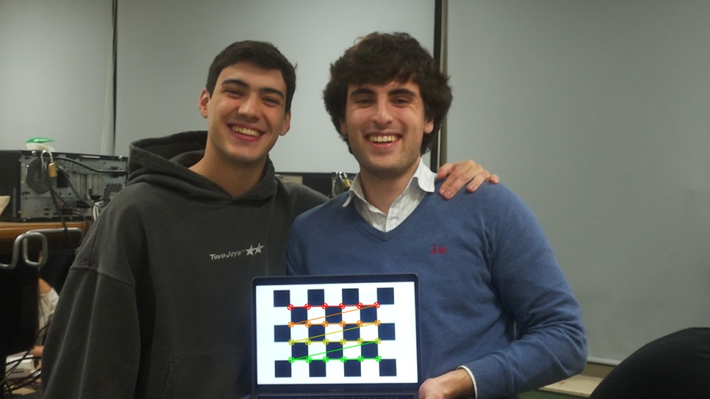

# **Reconocimiento de Cartas de la Baraja Española y Recomendación de Estrategias para el Mus**

Este proyecto implementa un sistema de visión por computadora para reconocer cartas de la baraja española y calcular probabilidades estratégicas para el juego de Mus. El sistema utiliza una Raspberry Pi con una cámara, OpenCV y Tesseract OCR para procesar imágenes en tiempo real.

---

## **Características del Proyecto**

- **Reconocimiento de Cartas:**
  - Detección y segmentación de cartas utilizando procesamiento de imágenes.
  - Reconocimiento de los valores de las cartas mediante OCR.
- **Cálculo de Estrategias:**
  - Simulación de partidas para calcular probabilidades de ganar en las categorías de grande, chica, par y juego.
- **Visualización en Tiempo Real:**
  - Mostrando FPS, cartas detectadas y probabilidades en la pantalla.

---

## **Requisitos**

### **Hardware**
- Raspberry Pi 4
- Cámara compatible (120º FOV recomendado)

### **Software**
- Python 3.9+
- Bibliotecas:
  - `opencv-python`
  - `numpy`
  - `pytesseract`
  - `imageio`

---

## **Instrucciones de Uso**

1. **Clonar el Repositorio:**
   ```bash
   git clone https://github.com/tu-usuario/reconocimiento-cartas-mus.git
   cd reconocimiento-cartas-mus

2. **Instalar Dependencias: Asegúrate de tener pip instalado y ejecuta:**
   ```bash
   pip install -r requirements.txt

3. **Configurar Tesseract OCR:**
  - Asegúrate de tener instalado Tesseract OCR en tu sistema.
  - Actualiza la variable pytesseract.pytesseract.tesseract_cmd en el código para apuntar a la ruta donde esté instalado Tesseract.

4. **Ejecutar el Sistema: Conecta la cámara a la Raspberry Pi y ejecuta:**
   ```bash
   python main.py

---
## **Estructura del Proyecto**
    reconocimiento-cartas-mus/
    ├── calibration/         # Código y datos para calibración de la cámara
    ├── data/                # Imágenes originales usadas para pruebas
    ├── data_processed/      # Imágenes procesadas (resultados intermedios)
    ├── main.py              # Código principal para detección en tiempo real
    ├── README.md            # Este archivo
    ├── requirements.txt     # Dependencias del proyecto
    └── utils.py             # Funciones auxiliares (opcional)

--- 
## **Calibración de la Cámara**

El sistema utiliza un patrón de tablero de ajedrez para calibrar la cámara y corregir distorsiones. Los resultados de la calibración incluyen:

- Matriz intrínseca: Representa las propiedades internas de la cámara.
- Coeficientes de distorsión: Modelan las distorsiones radiales y tangenciales de la lente.
- RMS (Error Medio Cuadrático de Reproyección): Indica la precisión de la calibración.


